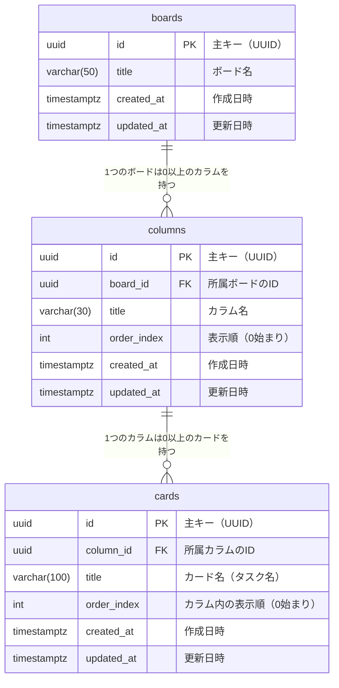

# ER図（データモデル設計）

> **注記**: 現フェーズではlocalStorageで実装するが、将来のDB移行を見据えてリレーショナルDB向けの設計で定義する。

---

## 1. ER図



---

## 2. エンティティ定義

### boards（ボード）

| カラム名 | 型 | NOT NULL | デフォルト | 説明 |
|----------|----|----------|-----------|------|
| id | UUID | ○ | gen_random_uuid() | 主キー |
| title | VARCHAR(50) | ○ | — | ボード名 |
| created_at | TIMESTAMPTZ | ○ | NOW() | 作成日時 |
| updated_at | TIMESTAMPTZ | ○ | NOW() | 最終更新日時 |

### columns（カラム）

| カラム名 | 型 | NOT NULL | デフォルト | 説明 |
|----------|----|----------|-----------|------|
| id | UUID | ○ | gen_random_uuid() | 主キー |
| board_id | UUID | ○ | — | 外部キー → boards.id |
| title | VARCHAR(30) | ○ | — | カラム名 |
| order_index | INTEGER | ○ | — | ボード内の表示順（0始まり） |
| created_at | TIMESTAMPTZ | ○ | NOW() | 作成日時 |
| updated_at | TIMESTAMPTZ | ○ | NOW() | 最終更新日時 |

### cards（カード）

| カラム名 | 型 | NOT NULL | デフォルト | 説明 |
|----------|----|----------|-----------|------|
| id | UUID | ○ | gen_random_uuid() | 主キー |
| column_id | UUID | ○ | — | 外部キー → columns.id |
| title | VARCHAR(100) | ○ | — | カード名（タスク名） |
| order_index | INTEGER | ○ | — | カラム内の表示順（0始まり） |
| created_at | TIMESTAMPTZ | ○ | NOW() | 作成日時 |
| updated_at | TIMESTAMPTZ | ○ | NOW() | 最終更新日時 |

---

## 3. リレーション定義

| 関係 | 種別 | 説明 |
|------|------|------|
| boards → columns | 1対多（1:N） | 1つのボードは複数のカラムを持てる |
| columns → cards | 1対多（1:N） | 1つのカラムは複数のカードを持てる |

**カスケード削除の方針**

| 操作 | 結果 |
|------|------|
| boards を削除 | 紐づく columns・cards をすべて削除（CASCADE） |
| columns を削除 | 紐づく cards をすべて削除（CASCADE） |
| cards を削除 | 単独で削除（影響なし） |

---

## 4. DDL（PostgreSQL）

```sql
-- ボードテーブル
CREATE TABLE boards (
    id          UUID        PRIMARY KEY DEFAULT gen_random_uuid(),
    title       VARCHAR(50) NOT NULL,
    created_at  TIMESTAMPTZ NOT NULL    DEFAULT NOW(),
    updated_at  TIMESTAMPTZ NOT NULL    DEFAULT NOW()
);

-- カラムテーブル
CREATE TABLE columns (
    id          UUID        PRIMARY KEY DEFAULT gen_random_uuid(),
    board_id    UUID        NOT NULL    REFERENCES boards(id) ON DELETE CASCADE,
    title       VARCHAR(30) NOT NULL,
    order_index INTEGER     NOT NULL,
    created_at  TIMESTAMPTZ NOT NULL    DEFAULT NOW(),
    updated_at  TIMESTAMPTZ NOT NULL    DEFAULT NOW()
);

-- カードテーブル
CREATE TABLE cards (
    id          UUID        PRIMARY KEY DEFAULT gen_random_uuid(),
    column_id   UUID        NOT NULL    REFERENCES columns(id) ON DELETE CASCADE,
    title       VARCHAR(100) NOT NULL,
    order_index INTEGER     NOT NULL,
    created_at  TIMESTAMPTZ NOT NULL    DEFAULT NOW(),
    updated_at  TIMESTAMPTZ NOT NULL    DEFAULT NOW()
);

-- インデックス（外部キー検索・表示順ソートを高速化）
CREATE INDEX idx_columns_board_id       ON columns(board_id);
CREATE INDEX idx_columns_board_order    ON columns(board_id, order_index);
CREATE INDEX idx_cards_column_id        ON cards(column_id);
CREATE INDEX idx_cards_column_order     ON cards(column_id, order_index);

-- updated_at を自動更新するトリガー関数
CREATE OR REPLACE FUNCTION set_updated_at()
RETURNS TRIGGER AS $$
BEGIN
    NEW.updated_at = NOW();
    RETURN NEW;
END;
$$ LANGUAGE plpgsql;

CREATE TRIGGER trg_boards_updated_at
    BEFORE UPDATE ON boards
    FOR EACH ROW EXECUTE FUNCTION set_updated_at();

CREATE TRIGGER trg_columns_updated_at
    BEFORE UPDATE ON columns
    FOR EACH ROW EXECUTE FUNCTION set_updated_at();

CREATE TRIGGER trg_cards_updated_at
    BEFORE UPDATE ON cards
    FOR EACH ROW EXECUTE FUNCTION set_updated_at();
```

---

## 5. localStorage → DB 移行時の対応方針

現フェーズのlocalStorageキー `task-management` に格納しているJSONを、将来DB移行する際の変換方針。

| localStorageのフィールド | DBのカラム | 変換内容 |
|--------------------------|-----------|---------|
| `boards[].id` | `boards.id` | そのままUUIDとして使用可能 |
| `boards[].title` | `boards.title` | そのまま移行 |
| `boards[].createdAt` | `boards.created_at` | ISO 8601文字列 → TIMESTAMPTZ |
| `columns[].order` | `columns.order_index` | フィールド名を変更（`order`はSQL予約語） |
| `cards[].order` | `cards.order_index` | 同上 |
| — | `*.updated_at` | 移行時は `created_at` と同値を入れる |

> **注意**: `order` はSQL予約語のため、DBカラム名は `order_index` としている。localStorage側のフィールド名も `orderIndex` に統一することを推奨する。

---

## 6. 将来の拡張ポイント（現スコープ外）

将来ユーザー認証やカード詳細機能を追加する際に拡張が想定されるテーブル。

```
users
├── id
├── email
├── name
└── created_at

boards に user_id（FK → users.id）を追加

cards に以下を追加する可能性
├── description（メモ・説明文）
├── due_date（期限）
└── assignee_id（担当者、FK → users.id）
```
