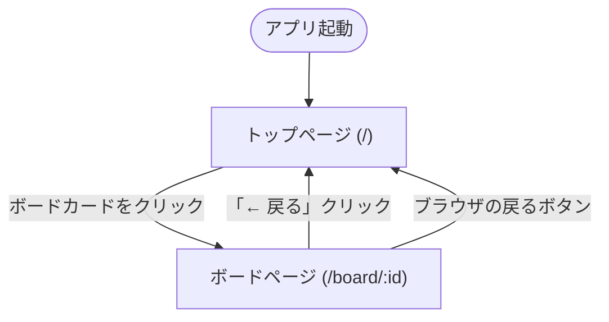
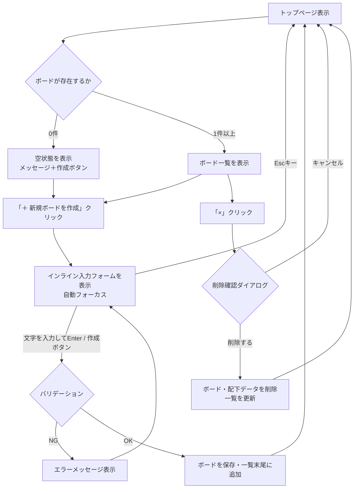
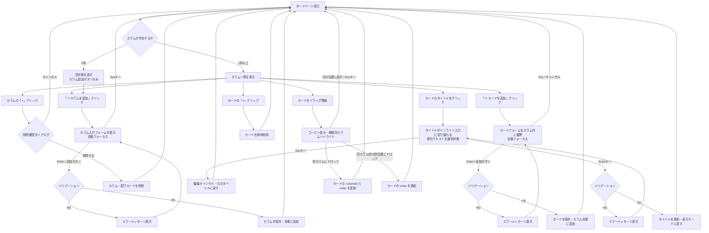

# 画面遷移図

---

## 1. ページ間遷移

---

## 2. トップページ内のUIフロー

---

## 3. ボードページ内のUIフロー

---

## 4. データ保存タイミング

| 操作 | 保存タイミング |
|------|--------------|
| ボード作成 | 作成確定時（即時） |
| ボード削除 | 削除確定時（即時） |
| カラム追加 | 追加確定時（即時） |
| カラム削除 | 削除確定時（即時） |
| カード追加 | 追加確定時（即時） |
| カード編集 | 編集確定時（Enterキー時） |
| カード削除 | 削除時（即時） |
| カード移動 | ドロップ完了時（即時） |
