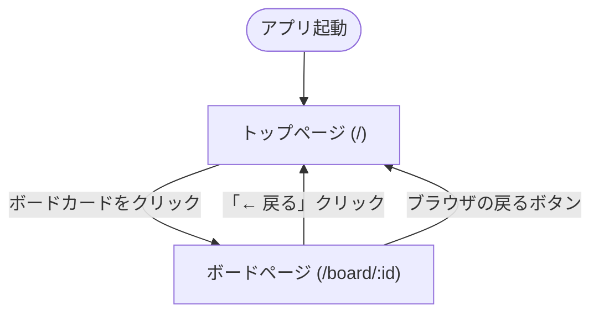
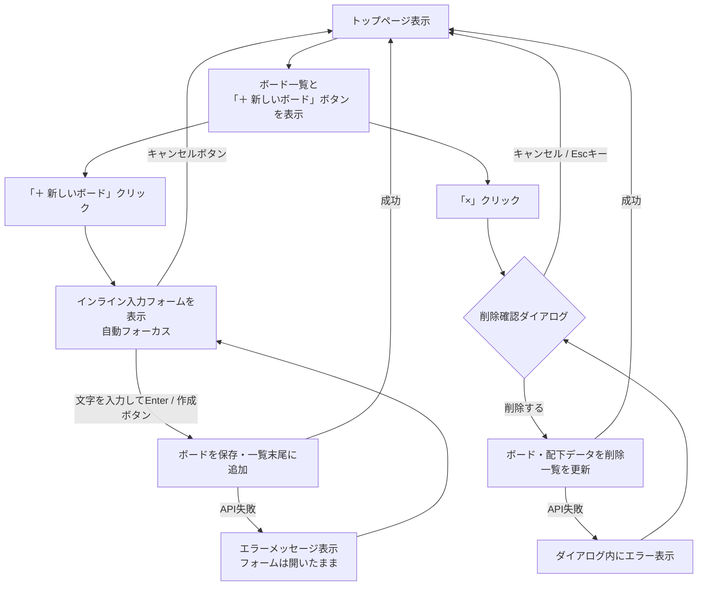
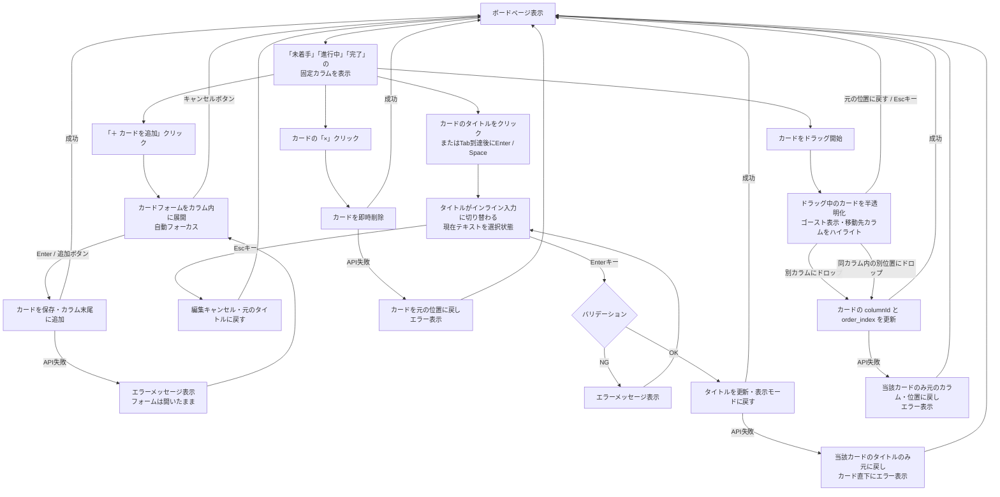

# 画面遷移図

---

## 1. ページ間遷移

```mermaid
flowchart TD
    Start([アプリ起動]) --> Top

    Top["トップページ (/)"]
    Board["ボードページ (/board/:id)"]

    Top -->|ボードカードをクリック| Board
    Board -->|「← 戻る」クリック| Top
    Board -->|ブラウザの戻るボタン| Top
```

---

## 2. トップページ内のUIフロー

```mermaid
flowchart TD
    Top[トップページ表示]

    Top --> List[ボード一覧と\n「＋ 新しいボード」ボタンを表示]

    %% ボード作成フロー
    List --> ClickCreate[「＋ 新しいボード」クリック]
    ClickCreate --> ShowForm[インライン入力フォームを表示\n自動フォーカス]

    ShowForm --> |キャンセルボタン| Top
    ShowForm --> |文字を入力してEnter / 作成ボタン| SaveBoard[ボードを保存・一覧末尾に追加]
    SaveBoard -->|API失敗| ShowError[エラーメッセージ表示\nフォームは開いたまま]
    ShowError --> ShowForm
    SaveBoard -->|成功| Top

    %% ボード削除フロー
    List --> ClickDelete[「×」クリック]
    ClickDelete --> Confirm{削除確認ダイアログ}
    Confirm -->|キャンセル / Escキー| Top
    Confirm -->|削除する| DeleteBoard[ボード・配下データを削除\n一覧を更新]
    DeleteBoard -->|API失敗| ConfirmError[ダイアログ内にエラー表示]
    ConfirmError --> Confirm
    DeleteBoard -->|成功| Top
```

---

## 3. ボードページ内のUIフロー

```mermaid
flowchart TD
    Board[ボードページ表示]

    Board --> Columns[「未着手」「進行中」「完了」の\n固定カラムを表示]

    %% カード追加フロー
    Columns --> ClickAddCard[「＋ カードを追加」クリック]
    ClickAddCard --> ShowCardForm[カードフォームをカラム内に展開\n自動フォーカス]
    ShowCardForm -->|キャンセルボタン| Board
    ShowCardForm -->|Enter / 追加ボタン| SaveCard[カードを保存・カラム末尾に追加]
    SaveCard -->|API失敗| CardError[エラーメッセージ表示\nフォームは開いたまま]
    CardError --> ShowCardForm
    SaveCard -->|成功| Board

    %% カード編集フロー
    Columns --> ClickTitle[カードのタイトルをクリック\nまたはTab到達後にEnter / Space]
    ClickTitle --> EditMode[タイトルがインライン入力に切り替わる\n現在テキストを選択状態]
    EditMode -->|Escキー| CancelEdit[編集キャンセル・元のタイトルに戻す]
    CancelEdit --> Board
    EditMode -->|Enterキー| ValidateEdit{バリデーション}
    ValidateEdit -->|NG| EditError[エラーメッセージ表示]
    EditError --> EditMode
    ValidateEdit -->|OK| SaveEdit[タイトルを更新・表示モードに戻す]
    SaveEdit -->|API失敗| Rollback[当該カードのタイトルのみ元に戻し\nカード直下にエラー表示]
    Rollback --> Board
    SaveEdit -->|成功| Board

    %% カード削除フロー
    Columns --> ClickDelCard[カードの「×」クリック]
    ClickDelCard --> DeleteCard[カードを即時削除]
    DeleteCard -->|API失敗| RestoreCard[カードを元の位置に戻し\nエラー表示]
    RestoreCard --> Board
    DeleteCard -->|成功| Board

    %% カード移動フロー（ドラッグ&ドロップ）
    Columns --> DragStart[カードをドラッグ開始]
    DragStart --> Dragging[ドラッグ中のカードを半透明化\nゴースト表示・移動先カラムをハイライト]
    Dragging -->|元の位置に戻す / Escキー| Board
    Dragging -->|別カラムにドロップ| MoveCard[カードの columnId と order_index を更新]
    Dragging -->|同カラム内の別位置にドロップ| MoveCard
    MoveCard -->|API失敗| RestoreMove[当該カードのみ元のカラム・位置に戻し\nエラー表示]
    RestoreMove --> Board
    MoveCard -->|成功| Board
```

> 更新系はいずれも楽観的にUIへ反映し、API失敗時は**当該カードの変更のみ**を元に戻す。
> ボード全体のスナップショットには戻さないため、並行して行われた他カードの更新は保持される。

---

## 4. データ保存タイミング

| 操作 | 保存タイミング |
|------|--------------|
| ボード作成 | 作成確定時（即時。固定カラムの自動生成も同時に保存） |
| ボード削除 | 削除確定時（即時） |
| カード追加 | 追加確定時（即時） |
| カード編集 | 編集確定時（Enterキー時） |
| カード削除 | 削除時（即時） |
| カード移動 | ドロップ完了時（即時） |
